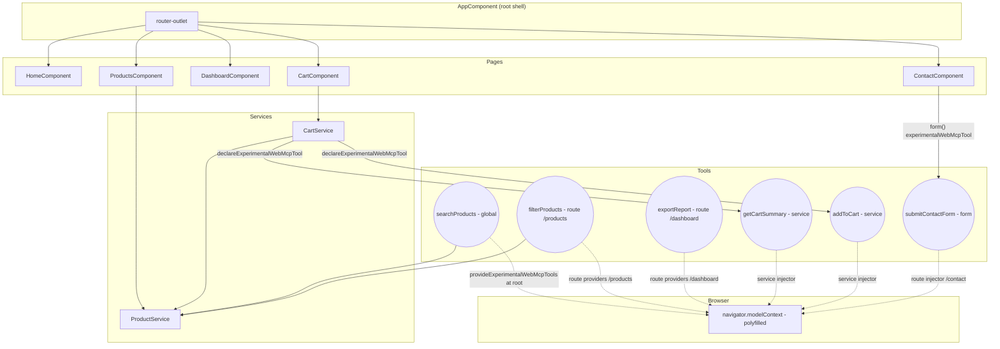

# Design Document

## Overview

The WebMCP Angular Demo is a small but complete Angular 22 (next) standalone application whose purpose is to make every WebMCP integration point visible and exercisable from the browser. The application loads the `@mcp-b/webmcp-polyfill` before bootstrap so `navigator.modelContext` exists, then registers tools at four different scopes: a Global_Tool registered at the application root, Route_Scoped_Tools registered through route `providers` on `/products` and `/dashboard`, Service_Scoped_Tools registered from inside `CartService` via `declareExperimentalWebMcpTool`, and a Form_Tool produced by `form()` from `@angular/forms/signals` on `/contact`.

Inspecting the live registry and invoking tools by hand is delegated to Chrome's WebMCP devtools extension; the demo intentionally does not duplicate that UI inside the application.

### Research Notes

This design relies on the experimental APIs documented in the source article and exposed in the Angular 22 next release line:

- `provideExperimentalWebMcpTools(...)` from `@angular/core` — a `Provider`-compatible factory that registers an array of tool descriptors with the active injector. When supplied to `bootstrapApplication`'s `providers`, the tools live for the application lifetime; when supplied through a `Route.providers`, the tools live for the route's injector lifetime.
- `declareExperimentalWebMcpTool(...)` from `@angular/core` — an imperative registration API meant to be called from within an injection context (typically a service constructor). The tool is registered for the lifetime of the calling injector and is unregistered when that injector is destroyed.
- `withExperimentalAutoCleanupInjectors()` from `@angular/router` — a `provideRouter` feature that ensures route injectors are torn down when their routes deactivate, which is what makes Route_Scoped_Tool unregistration automatic.
- `form()` and validators from `@angular/forms/signals` — the new signal-based forms API. Passing the `experimentalWebMcpTool: { name, description }` option causes the form to register a Form_Tool whose JSON schema is inferred from the form's signal model and whose handler runs the form's validators before submission.
- `@mcp-b/webmcp-polyfill` — a no-op import that, when loaded before any code reads `navigator.modelContext`, shims the runtime in browsers that do not yet ship a native implementation. It exposes `registerTool`, `unregisterTool`, `listTools`, `callTool`, and an event-emitter-style change subscription on `navigator.modelContext`.

The design treats `navigator.modelContext` as the single source of truth for the registry. The demo never duplicates the registry in its own data structures — Chrome's WebMCP devtools extension reads it directly.

## Architecture

### High-Level Approach

- **Module-free, standalone components only.** Every component declares its own imports. There are zero `NgModule` classes.
- **OnPush everywhere.** Every component sets `changeDetection: ChangeDetectionStrategy.OnPush` and uses signals for local state, so change detection is driven by signal reads inside the template.
- **Signals for state, RxJS only where it already exists.** Component and service state is held in `signal`, `computed`, and `effect`.
- **One injector per scope.** The application injector owns the Global_Tool. Each route that registers Route_Scoped_Tools relies on its route injector (kept alive only for the duration of the route, courtesy of `withExperimentalAutoCleanupInjectors()`). `CartService` is provided in the route injector for `/cart` so its lifetime is tied to that page.
- **Polyfill-first bootstrap.** The polyfill is imported at the top of `main.ts` before the dynamic `bootstrapApplication` call.

### Folder Structure

```
src/
├── main.ts                                  # imports polyfill, then bootstraps
├── index.html
├── styles.css
└── app/
    ├── app.config.ts                        # ApplicationConfig, providers, router
    ├── app.routes.ts                        # Route table with route providers
    ├── app.component.ts                     # Root shell: nav + <router-outlet>
    ├── core/
    │   ├── webmcp/
    │   │   ├── tool-descriptor.ts           # Shared TS types (JsonSchema)
    │   │   ├── structured-response.ts       # Structured_Response helpers
    │   │   ├── validate.ts                  # Hand-rolled JSON-schema validator
    │   │   └── global-tools.ts              # searchProducts tool factory (used by app.config)
    │   └── catalog/
    │       └── product.service.ts           # In-memory product catalog
    ├── cart/
    │   └── cart.service.ts                  # declareExperimentalWebMcpTool for cart tools
    ├── pages/
    │   ├── home/home.component.ts
    │   ├── products/
    │   │   ├── products.component.ts
    │   │   └── products.tools.ts            # filterProducts factory
    │   ├── dashboard/
    │   │   ├── dashboard.component.ts
    │   │   └── dashboard.tools.ts           # exportReport factory
    │   ├── cart/cart.component.ts
    │   └── contact/contact.component.ts     # form() with experimentalWebMcpTool
```

The demo intentionally has no in-app inspector or manual invoker — Chrome's WebMCP devtools extension already provides both surfaces against `navigator.modelContext`.

### Component and Service Map




## Components and Interfaces

All components are standalone, OnPush, and use signals. None inject `ChangeDetectorRef`. Inputs are declared with `input()` / `input.required()`; outputs with `output()`.

### `AppComponent` (root shell)

- **Responsibility:** Render the top navigation and the `<router-outlet>`.
- **State:** None of its own. Reads no signals directly; the children manage their state.
- **Template:** `@for` over a static nav-link array followed by `<router-outlet />`.
- **OnPush note:** No mutation happens here, so OnPush is trivially satisfied.

### `HomeComponent` (`/`)

- **Responsibility:** Render an overview describing the demo and listing what each route exposes.
- **State:** Static text only.
- **Tools:** None. The Global_Tool is registered by the application injector, not by this component.

### `ProductsComponent` (`/products`)

- **Responsibility:** Render the product catalog, expose UI filters that mirror the Filter_Products_Tool inputs.
- **Inputs/Outputs:** None.
- **Signals:**
  - `category = signal<string | null>(null)`
  - `maxPrice = signal<number | null>(null)`
  - `visibleProducts = computed(() => productService.filter({ category: category(), maxPrice: maxPrice() }))`
- **OnPush note:** All template reads go through signals; user inputs use `(input)` handlers that call `signal.set`.
- **Tool registration:** Lives in the `Route.providers` array, not in the component, so the tool exists for the duration of the route injector regardless of component instantiation.

### `DashboardComponent` (`/dashboard`)

- **Responsibility:** Render a fake analytics dashboard with a "format" picker and an "Export" button.
- **Signals:** `format = signal<'pdf' | 'csv' | 'json'>('pdf')`, `lastExport = signal<StructuredResponse | null>(null)`.
- **Behavior:** The Export button calls the same handler the Export_Report_Tool uses, sourced from a shared factory in `dashboard.tools.ts`. This keeps the UI button and the tool semantically identical.
- **Tool registration:** Route-level via `provideExperimentalWebMcpTools` in the route entry.

### `CartComponent` (`/cart`)

- **Responsibility:** Render the cart contents (from `CartService`) and provide an "Add demo item" button.
- **Signals:** Reads `cartService.items`, `cartService.itemCount`, `cartService.total` (all signals).
- **Tool registration:** None at the component or route level. `CartService` is `providedIn: 'root'` so its tools live for the application lifetime; if the design later moves it under the route, the tools will follow that injector.

### `ContactComponent` (`/contact`)

- **Responsibility:** Host the Signal Form and render success / validation error feedback.
- **Form:** Built with `form()` from `@angular/forms/signals`. The `experimentalWebMcpTool` option is set with name `submitContactForm` and a description string.
- **Signals:** `submission = signal<StructuredResponse | null>(null)`. The form itself is the source of truth for field state.
- **Submit flow:** A "Submit" button calls the same submit action the Form_Tool's handler invokes, so manual UI submission and tool-driven submission are indistinguishable.

## Services

### `ProductService` (`providedIn: 'root'`)

In-memory catalog used by the Search_Products_Tool, the Filter_Products_Tool, and `CartService`.

```ts
@Injectable({ providedIn: 'root' })
export class ProductService {
  private readonly _products = signal<readonly Product[]>(SEED_PRODUCTS);
  readonly products: Signal<readonly Product[]> = this._products.asReadonly();

  search(query: string): Product[] { /* case-insensitive name/description match */ }
  filter(opts: { category?: string | null; maxPrice?: number | null }): Product[] { /* ... */ }
  findById(id: string): Product | undefined { /* ... */ }
}
```

The catalog is seeded from a constant `SEED_PRODUCTS` array; the service exposes signals so consumers stay OnPush-friendly.

### `CartService` (`providedIn: 'root'`)

Owns cart state and registers Service_Scoped_Tools from its constructor.

```ts
@Injectable({ providedIn: 'root' })
export class CartService {
  private readonly products = inject(ProductService);
  private readonly _items = signal<CartLine[]>([]);
  readonly items: Signal<readonly CartLine[]> = this._items.asReadonly();
  readonly itemCount = computed(() => this._items().reduce((n, l) => n + l.quantity, 0));
  readonly total = computed(() => this._items().reduce((n, l) => n + l.quantity * l.price, 0));

  constructor() {
    declareExperimentalWebMcpTool({
      name: 'getCartSummary',
      description: 'Return the current cart line items, item count, and total price.',
      inputSchema: { type: 'object', properties: {}, additionalProperties: false },
      execute: () => ok(this.snapshot()),
    });

    declareExperimentalWebMcpTool({
      name: 'addToCart',
      description: 'Add a product to the cart by id and quantity.',
      inputSchema: ADD_TO_CART_SCHEMA,
      execute: (args) => this.addToCartHandler(args),
    });
  }

  addToCartHandler(args: unknown): StructuredResponse { /* validate, mutate, return */ }
  snapshot() { return { items: this._items(), itemCount: this.itemCount(), total: this.total() }; }
}
```

Because `declareExperimentalWebMcpTool` is called inside the service constructor inside an injection context, the tools are bound to the service's injector and will be unregistered when that injector is destroyed (validated by Property 3).

## Data Models

```ts
// core/webmcp/structured-response.ts
export type StructuredResponseStatus = 'success' | 'error';

export interface StructuredResponse<T = unknown> {
  status: StructuredResponseStatus;
  payload: T;
}

export const ok = <T>(payload: T): StructuredResponse<T> => ({ status: 'success', payload });
export const err = (code: string, message: string, details?: unknown): StructuredResponse =>
  ({ status: 'error', payload: { code, message, details } });
```

```ts
// core/webmcp/tool-descriptor.ts
// Minimal structural JSON Schema sufficient for every schema the demo declares.
// The runtime descriptor type is `ToolListItem` from the WebMCP types
// (re-exported by `@angular/core/third_party/@mcp-b/webmcp-types`).
export interface JsonSchema {
  readonly type: 'object' | 'string' | 'integer' | 'number';
  readonly properties?: Readonly<Record<string, JsonSchema>>;
  readonly required?: readonly string[];
  readonly additionalProperties?: boolean;
  readonly enum?: readonly unknown[];
  readonly minimum?: number;
}
```

```ts
// core/catalog/product.ts
export interface Product {
  readonly id: string;
  readonly name: string;
  readonly description: string;
  readonly category: 'audio' | 'wearable' | 'home' | 'office';
  readonly price: number;         // non-negative
}
```

```ts
// cart/cart-line.ts
export interface CartLine {
  readonly productId: string;
  readonly name: string;
  readonly price: number;         // unit price snapshot at add-time
  readonly quantity: number;      // positive integer
}

export interface CartSummary {
  readonly items: readonly CartLine[];
  readonly itemCount: number;
  readonly total: number;
}
```

```ts
// pages/contact/contact-form.model.ts
export interface ContactFormModel {
  name: string;        // required, min length 1
  email: string;       // required, email pattern
  topic: 'support' | 'sales' | 'feedback';
  message: string;     // required, min length 10
}
```

The contact form's signal model is `signal<ContactFormModel>({...})` and the validators are wired through `form()`'s validator API (`required`, `email`, `minLength`, `pattern` from `@angular/forms/signals`).

## Tool Definitions

Every tool produces a `StructuredResponse` and validates its arguments against an explicit JSON schema before any side effect. Every name is a verb-phrase in lowerCamelCase.

| Name | Scope | Registered via | Input schema (summary) | Handler responsibility |
| --- | --- | --- | --- | --- |
| `searchProducts` | global | `provideExperimentalWebMcpTools` in `ApplicationConfig.providers` | `{ query: string }` (required, non-empty string) | Validate `query`, call `ProductService.search`, return `ok({ matches: Product[] })`; on missing/non-string `query` return `err('validation', ...)`. |
| `filterProducts` | route (`/products`) | `provideExperimentalWebMcpTools` in `Route.providers` | `{ category?: 'audio'\|'wearable'\|'home'\|'office', maxPrice?: number >= 0 }` | Validate, call `ProductService.filter`, return `ok({ matches })`; on out-of-schema args return `err('validation', ...)`. |
| `exportReport` | route (`/dashboard`) | `provideExperimentalWebMcpTools` in `Route.providers` | `{ format: 'pdf' \| 'csv' \| 'json' }` | Validate `format`, build a stub report payload (e.g. `{ format, generatedAt, rows: 42 }`), return `ok(...)`. Out-of-enum returns `err('validation', ...)`. |
| `getCartSummary` | service (`CartService`) | `declareExperimentalWebMcpTool` in `CartService` ctor | `{}` (no fields) | Return `ok(CartSummary)` from the current signals. |
| `addToCart` | service (`CartService`) | `declareExperimentalWebMcpTool` in `CartService` ctor | `{ productId: string, quantity: integer >= 1 }` | Validate schema; if `productId` not in catalog return `err('not_found', ...)`; if `quantity` invalid return `err('validation', ...)`; otherwise mutate `_items` and return `ok(CartSummary)`. |
| `submitContactForm` | form (`/contact`) | `form()`'s `experimentalWebMcpTool` option | Inferred from `ContactFormModel` plus validators | Run all form validators; if any fail, return `err('validation', { fieldErrors })` and do not submit; if all pass, run the submit action and return `ok({ submitted: true, ticketId })`. |

The "Scope" column above is documentation only — it describes where in the application each tool is registered. Chrome's WebMCP devtools extension is the canonical place to observe scope behavior at runtime: route-scoped tools appear/disappear with navigation, and service-scoped tools disappear when their owning service injector is destroyed.

## Routing Configuration

`app.routes.ts` declares the route table and binds Route_Scoped_Tools through each route's `providers`. The route injector is what `withExperimentalAutoCleanupInjectors()` cleans up on deactivation, which is what makes the tools disappear.

```ts
// app.routes.ts
import { Routes } from '@angular/router';
import { provideExperimentalWebMcpTools } from '@angular/core';
import { filterProductsTool } from './pages/products/products.tools';
import { exportReportTool } from './pages/dashboard/dashboard.tools';

export const APP_ROUTES: Routes = [
  { path: '', loadComponent: () => import('./pages/home/home.component').then(m => m.HomeComponent) },
  {
    path: 'products',
    loadComponent: () => import('./pages/products/products.component').then(m => m.ProductsComponent),
    providers: [provideExperimentalWebMcpTools([filterProductsTool])],
  },
  {
    path: 'dashboard',
    loadComponent: () => import('./pages/dashboard/dashboard.component').then(m => m.DashboardComponent),
    providers: [provideExperimentalWebMcpTools([exportReportTool])],
  },
  {
    path: 'cart',
    loadComponent: () => import('./pages/cart/cart.component').then(m => m.CartComponent),
  },
  {
    path: 'contact',
    loadComponent: () => import('./pages/contact/contact.component').then(m => m.ContactComponent),
  },
  { path: '**', redirectTo: '' },
];
```

```ts
// app.config.ts
import { ApplicationConfig, provideExperimentalWebMcpTools } from '@angular/core';
import { provideExperimentalWebMcpForms } from '@angular/forms/signals';
import { provideRouter, withExperimentalAutoCleanupInjectors } from '@angular/router';
import { APP_ROUTES } from './app.routes';
import { searchProductsTool } from './core/webmcp/global-tools';

export const appConfig: ApplicationConfig = {
  providers: [
    provideRouter(APP_ROUTES, withExperimentalAutoCleanupInjectors()),
    provideExperimentalWebMcpTools([searchProductsTool]),
    provideExperimentalWebMcpForms(),
  ],
};
```

The Form_Tool for `/contact` is registered through `form()`'s own `experimentalWebMcpTool` option inside `ContactComponent`. Because that registration happens in the component's injection context, and the component is created inside the `/contact` route injector, navigating away tears the component down and unregisters the tool — which is exactly what `withExperimentalAutoCleanupInjectors()` enables.

## Bootstrap Sequence

`main.ts` imports the polyfill before any code touches `navigator.modelContext`. The polyfill mutates the `navigator` global on import, so subsequent `inject(ToolRegistryService)` calls see a populated runtime.

```ts
// main.ts
import '@mcp-b/webmcp-polyfill';                 // 1. Polyfill installs navigator.modelContext
import { bootstrapApplication } from '@angular/platform-browser';
import { AppComponent } from './app/app.component';
import { appConfig } from './app/app.config';

bootstrapApplication(AppComponent, appConfig)    // 2. Angular boots, providers run, global tool registers
  .catch((err) => console.error(err));
```

Order matters:

1. The polyfill runs at import time and installs `navigator.modelContext` if it is missing.
2. `bootstrapApplication` evaluates `appConfig.providers`, which calls `provideExperimentalWebMcpTools([searchProductsTool])`. The Global_Tool is now registered.
3. The router is constructed with `withExperimentalAutoCleanupInjectors()` so route injectors are torn down on deactivation.
4. Subsequent navigation registers/unregisters Route_Scoped_Tools and Form_Tools; `CartService`'s constructor registers Service_Scoped_Tools the first time it is injected.

## Acceptance Criteria Testing Prework

The full prework analysis was performed using the `prework` tool. The summary below records the classification of each acceptance criterion; the per-criterion reasoning is stored in the prework context and informs the property set in the next section.

| Criterion | Classification | Rationale (one line) |
| --- | --- | --- |
| 1.1 polyfill loaded before bootstrap | SMOKE | One-time import-order check. |
| 1.2 searchProducts registered as global | EXAMPLE | Single bootstrap-time check. |
| 1.3 searchProducts returns Structured_Response with matches | PROPERTY | Universal over catalogs and queries. |
| 1.4 invalid query yields validation error | PROPERTY | Universal over non-string inputs. |
| 1.5 router uses `withExperimentalAutoCleanupInjectors()` | SMOKE | Configuration check. |
| 2.1–2.4 route-scoped tools register/unregister with navigation | PROPERTY | Captured by the registry-parity property. |
| 2.5 exportReport accepts pdf/csv/json | PROPERTY | Universal over enum membership. |
| 2.6 filterProducts returns filtered list | PROPERTY | Universal over catalogs and filter args. |
| 2.7 invalid args produce validation errors | PROPERTY | Subsumed by the response-shape property. |
| 3.1 cart tools registered from constructor | EXAMPLE | One-time post-instantiation check. |
| 3.2 getCartSummary returns correct totals | PROPERTY | Cart invariant. |
| 3.3 / 3.4 / 3.5 addToCart valid/invalid behavior | PROPERTY | Combined into the addToCart invariant. |
| 3.6 destroying service injector unregisters tools | PROPERTY | Scope-lifecycle property. |
| 4.1 contact form built with `experimentalWebMcpTool` option | SMOKE | Configuration check. |
| 4.2 / 4.5 form tool present iff on /contact | PROPERTY | Subsumed by registry parity. |
| 4.3 / 4.4 valid/invalid form input behavior | PROPERTY | Validator-gating property. |
| 7.1 / 7.2 / 7.3 well-formed descriptors | PROPERTY | Combined into descriptor-shape property. |
| 7.4 schema validation before side effect | PROPERTY | Combined into addToCart and form-validator gating. |
| 7.5 every handler returns Structured_Response | PROPERTY | Response-shape property over the entire registry. |
| 8.1 dependencies on `@next` | SMOKE | package.json check. |
| 8.2–8.6 stack and convention rules | SMOKE | Static AST/template checks. |

> Note: Requirement IDs 5 and 6 were retired together with the in-app Tool Inspector and Manual Invoker UIs. Numbering for the remaining requirements is preserved so existing source-code comments and test annotations stay in sync.

After redundancy reflection (full reasoning in the prework context), we keep six properties below, numbered 1–3 and 5–7. Property 4 (Tool Inspector equality) was retired together with the in-app inspector/invoker surface; the remaining numbering is preserved so existing source-code comments and test annotations stay in sync.

## Correctness Properties

*A property is a characteristic or behavior that should hold true across all valid executions of a system — essentially, a formal statement about what the system should do. Properties serve as the bridge between human-readable specifications and machine-verifiable correctness guarantees.*

### Property 1: Every tool handler returns a Structured_Response

*For any* tool currently registered with the WebMCP_Runtime and *for any* JSON-serializable input, invoking the tool through `navigator.modelContext.callTool(name, input)` returns an object whose `status` field is exactly `'success'` or `'error'` and which has a defined `payload` field.

**Validates: Requirements 1.3, 1.4, 2.5, 2.6, 2.7, 3.2, 3.3, 3.4, 3.5, 4.3, 4.4, 7.5**

### Property 2: Registry parity with navigation

*For any* sequence of router navigations across the routes `/`, `/products`, `/dashboard`, `/cart`, and `/contact`, after each navigation completes the set of tool names returned by `navigator.modelContext.listTools()` is exactly the union of (a) the Global_Tool names, (b) the Route_Scoped_Tool names declared on the active route's `providers`, (c) any Service_Scoped_Tool names whose owning service injector is still alive, and (d) the Form_Tool name(s) attached to components currently mounted on the active route.

**Validates: Requirements 2.1, 2.2, 2.3, 2.4, 4.2, 4.5**

### Property 3: Service-injector destruction unregisters service tools

*For any* injector hosting a `CartService` instance, after that injector is destroyed the names `getCartSummary` and `addToCart` are no longer present in `navigator.modelContext.listTools()`.

**Validates: Requirements 3.6**

### Property 5: `addToCart` mutates state only on valid input

*For any* `CartService` state and *for any* candidate args `{ productId, quantity }`, after invoking `addToCart(args)` the cart state is changed *if and only if* `productId` is the id of a product in the catalog AND `quantity` is a positive integer; in every other case the cart state is byte-for-byte unchanged and the response has `status === 'error'`.

**Validates: Requirements 3.3, 3.4, 3.5, 7.4**

### Property 6: Contact form rejects invalid input without submitting

*For any* `ContactFormModel` value that fails one or more of the form's declared validators, invoking `submitContactForm` returns a Structured_Response with `status === 'error'` and the form's submit action is not invoked. Conversely, *for any* value satisfying every validator, the submit action is invoked exactly once and the response has `status === 'success'`.

**Validates: Requirements 4.3, 4.4, 7.4**

### Property 7: Every registered descriptor is well-formed

*For any* descriptor returned by `navigator.modelContext.listTools()`, the descriptor's `name` matches `/^[a-z][a-zA-Z0-9]*$/` (lowerCamelCase), its `description` is a non-empty string, and its `inputSchema` is an object with an explicit `type` field.

**Validates: Requirements 7.1, 7.2, 7.3**

> Note: Property 4 (Tool Inspector equality) was retired together with the in-app Tool Inspector and Manual Invoker UIs. Property numbering for the remaining six properties is preserved so existing test annotations and source-code comments stay in sync.

## Error Handling

### Tool Handlers

Every tool handler follows the same shape:

```ts
function handler(rawArgs: unknown): StructuredResponse {
  const parsed = validate(rawArgs, SCHEMA);     // structural + type check
  if (!parsed.ok) return err('validation', parsed.message, parsed.details);
  try {
    const payload = doWork(parsed.value);       // pure or signal-mutating
    return ok(payload);
  } catch (e) {
    return err('internal', (e as Error).message);
  }
}
```

Validation runs before any side effect (Property 5 and Property 6 depend on this ordering). The `err` helper always returns the `StructuredResponse` shape so Property 1 holds for every code path. We use a small hand-rolled `validate` over JSON Schema rather than pulling in Ajv for the demo; the schemas are tiny.

### Polyfill Caveats

- The polyfill is a runtime shim. If a browser ships a native `navigator.modelContext`, the polyfill should detect it and no-op; we treat both cases identically. The demo never reads `navigator.modelContext` from application code — Chrome's WebMCP devtools extension is the only consumer outside Angular's `provideExperimentalWebMcpTools` / `declareExperimentalWebMcpTool` registration paths.
- If `navigator.modelContext` is unexpectedly missing at startup (e.g. the polyfill import was tree-shaken), the registration providers throw at bootstrap time. The application logs an error in the console rather than swallowing it.

### Routing

- Route guards are not used. If they are added later, the route injector is still created before the guard resolves, so Route_Scoped_Tools registered through `Route.providers` will appear briefly even if the guard later denies activation. The design assumes no guards in this demo.
- Lazy-loaded routes mean the route's `providers` array is evaluated on first navigation. The auto-cleanup feature still tears the injector down on deactivation, so subsequent navigations re-register from scratch.

## Testing Strategy

### Property-Based Tests (PBT applies)

PBT applies to the parts of this demo that have meaningful input variation: tool handlers, the registry parity invariant, the cart invariant, the form validator gating, and descriptor well-formedness. We pick **fast-check** as the property-based testing library for the target language (TypeScript) and run each property test for a minimum of 100 iterations. Each PBT is tagged with a comment in the form `// Feature: webmcp-angular-demo, Property N: <property text>` for traceability.

PBT targets, mapped to the six retained properties (numbering keeps the original gaps so source comments stay valid):

1. **Property 1 (response shape).** For each registered tool, generate arbitrary JSON inputs with `fc.anything()` and assert `response.status` is `'success'` or `'error'` and `response.payload !== undefined`.
2. **Property 2 (registry parity).** Generate random navigation sequences with `fc.array(fc.constantFrom('/', '/products', '/dashboard', '/cart', '/contact'))`, drive the router through them, and after each step assert set equality between `listTools()` and the expected union of (global, active-route, alive-service, active-form) tool names.
3. **Property 3 (service teardown).** Generate random create/destroy sequences for child injectors hosting `CartService` and assert that after each destroy the cart tool names are absent.
4. **Property 5 (`addToCart` invariant).** Generate random `(productId, quantity)` tuples mixing valid and invalid values; assert state changes iff inputs are valid and that response status reflects validity.
5. **Property 6 (form validator gating).** Generate random `ContactFormModel` values that systematically pass or violate each validator; assert that the submit action (a `vi.fn()`) is called exactly when all validators pass and the response status matches.
6. **Property 7 (descriptor shape).** Walk `listTools()` after navigating to each route and assert every descriptor satisfies the lowerCamelCase + non-empty description + explicit-`type` schema constraint.

Configuration:

- Each `fc.assert` runs with `{ numRuns: 100 }` minimum.
- Generators for "JSON-serializable input" use `fc.jsonValue()`.
- For tests that need a router and a real injector, we use Angular's `TestBed` with the same `provideRouter(APP_ROUTES, withExperimentalAutoCleanupInjectors())` configuration.

### Example-Based Tests (sufficient on their own)

These cases either don't vary meaningfully with input or are configuration checks:

- **Bootstrap order (1.1, 1.5, 8.1):** Static checks on `main.ts` and `package.json`.
- **Initial registration (1.2, 3.1, 4.1):** TestBed-style integration tests that bootstrap the app (or instantiate `CartService`) and assert specific tool names are listed.
- **Static stack rules (8.2–8.6):** A small AST/grep-style test that scans `src/app/**` for `@NgModule`, missing `standalone: true`, missing `OnPush`, and uses of `*ngIf`/`*ngFor`/`*ngSwitch`. Failing matches fail the test.
- **Smoke render of each page:** A single Vitest example test per page route that the component renders without throwing.

### Test Boundaries

- Tool handlers are tested directly (pure functions over their args plus injected services), separately from `navigator.modelContext`. A thin integration test then asserts that `callTool('searchProducts', ...)` reaches the same handler.
- The polyfill is treated as an external dependency; we do not test its internals. We do verify that after import `navigator.modelContext.listTools` is a function.
- The signal-forms `experimentalWebMcpTool` integration is tested at the boundary: we assert the registered tool exists and that calling it routes through the form's validators (Property 6 covers the behavior).

---

**Phase complete.** The design covers architecture, components, services, data models, tool definitions, routing, bootstrap, correctness properties, error handling, and testing strategy for the WebMCP Angular Demo. Please review `.kiro/specs/webmcp-angular-demo/design.md` and let me know if anything should change before we move on to the tasks phase.
