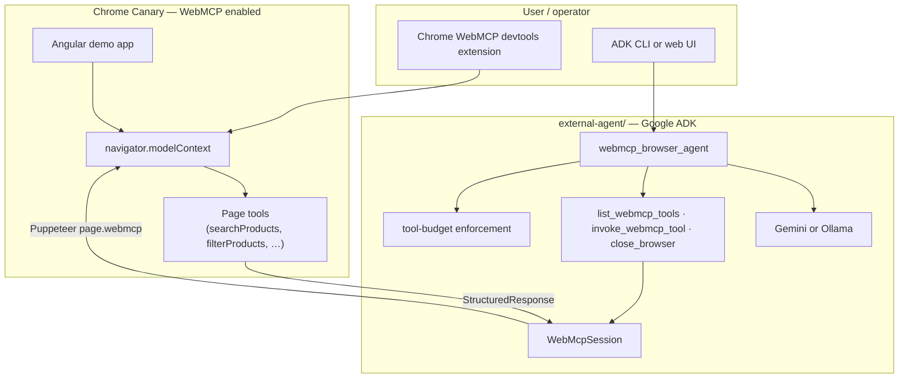
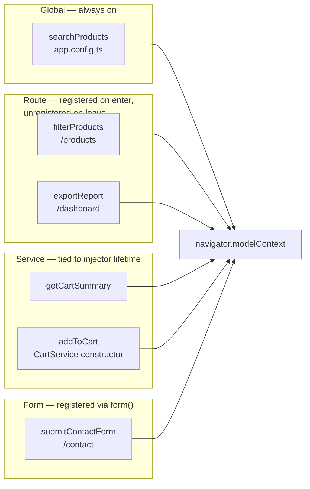
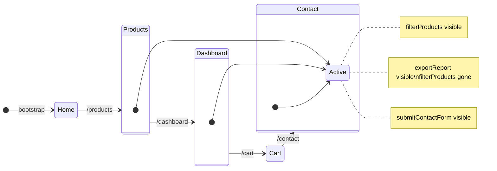
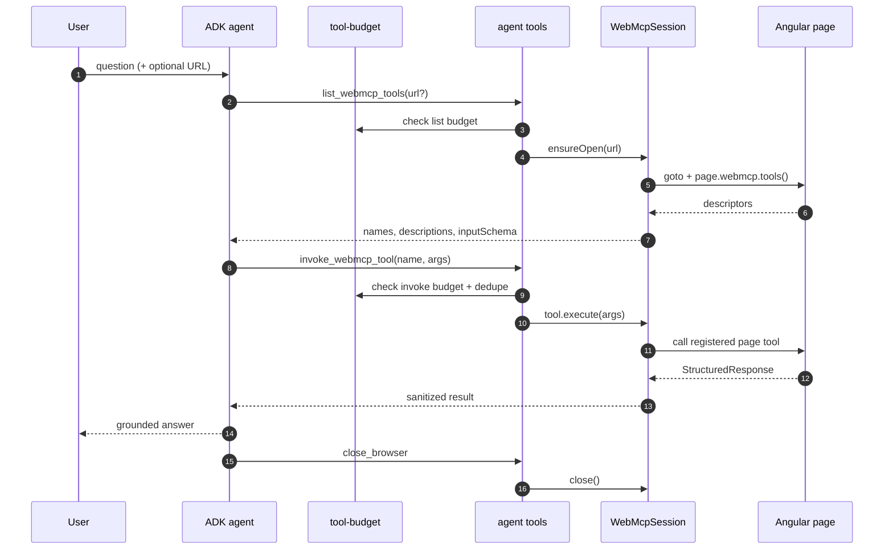

# webmcp-angular-demo

A small Angular 22 application that demonstrates every WebMCP integration scope the Angular framework currently exposes: a global tool at the application root, route-scoped tools via `Route.providers`, service-scoped tools from a service constructor, and a form-scoped tool from the Signal Forms `form()` API. A separate **external agent** (Google ADK + Puppeteer) can browse those pages and answer questions using only page tool results.

The demo intentionally has no in-app inspector or manual invoker — Chrome's WebMCP devtools extension already provides both surfaces against `navigator.modelContext`.

## Quick start

```bash
nvm use 22.22.3          # or nvm install 22.22.3
npm install
npm start                # Angular app at http://localhost:4200/
```

To run the external agent against the local app:

```bash
cp .env.example .env     # set GEMINI_API_KEY and WEBMCP_URL=http://localhost:4200
npm run external-agent   # ADK CLI, interactive
# or
npm run external-agent:web  # ADK web UI
```

Requires **Chrome Canary** with the WebMCP feature flag (used by Puppeteer).

## Commands

| Command | Description |
| --- | --- |
| `npm start` | Dev server (`ng serve`) at `http://localhost:4200/` |
| `npm test` | Unit, integration, and property-based tests (Vitest) |
| `npm run lint` | ESLint with angular-eslint, max-warnings 0 |
| `npm run lint:fix` | Auto-fix safe lint issues |
| `npm run format` | Prettier write |
| `npm run format:check` | Prettier verify |
| `npm run build` | Production build |
| `npm run deploy` | Build and deploy to Firebase Hosting |
| `npm run external-agent` | Run the ADK agent CLI (`external-agent/agent.ts`) |
| `npm run external-agent:web` | Run the ADK web UI for the agent |
| `npm run experiment:build` | Compile the external-agent package to `dist/` |
| `npm run experiment:start` | Minimal Puppeteer script that lists page tools |
| `npm run evals` | WebMCP evals (products, cart, negative) |

## Architecture

The repository has two cooperating parts: an **Angular demo app** that registers WebMCP tools at different lifetimes, and an **external agent** that drives a real browser to discover and invoke those tools.



Design specs live in [`.kiro/specs/webmcp-angular-demo/`](.kiro/specs/webmcp-angular-demo/).

### WebMCP tool scopes

Tools are registered at four lifetimes. Only tools whose scope is active on the current route appear in `navigator.modelContext`.



The router uses `withExperimentalAutoCleanupInjectors()` so route-scoped providers (and their tools) are released when the user navigates away.



`CartService` is `providedIn: 'root'` and materialized eagerly via `provideAppInitializer`, so its service-scoped tools are registered at bootstrap and remain available on every route.

### External agent workflow

The agent follows a strict, budgeted workflow: list page tools once, invoke at most once per page tool name, answer only from results, then close the browser.



Hard limits (configurable via `.env`) are enforced in code by `enforceToolBudget`, not only in the system prompt:

| Limit | Default | Env variable |
| --- | --- | --- |
| `list_webmcp_tools` calls per user message | 1 | `WEBMCP_MAX_LIST_TOOLS` |
| `invoke_webmcp_tool` calls per user message | 3 | `WEBMCP_MAX_INVOKES` |
| Same page tool name per message | 1 | (always enforced) |

LLM selection (`external-agent/llm/model.ts`):

1. `ADK_MODEL=gemini-*` → Gemini (default model: `gemini-3.5-flash`)
2. `ADK_MODEL=ollama` or `llama*` → local Ollama
3. `GEMINI_API_KEY` set, no `ADK_MODEL` → Gemini
4. Otherwise → Ollama `llama3.1`

## Demo tour

Each route registers tools at a different scope. Open Chrome's WebMCP devtools extension and watch `navigator.modelContext` change as you navigate.

| Route | Tool(s) | Scope |
| --- | --- | --- |
| `/` | (none) | overview page |
| `/products` | `filterProducts` | route-scoped (`Route.providers`) |
| `/dashboard` | `exportReport` | route-scoped (`Route.providers`) |
| `/cart` | `getCartSummary`, `addToCart` | service-scoped (`CartService` constructor) |
| `/contact` | `submitContactForm` | form-scoped (`form()` `experimentalWebMcpTool` option) |

The `searchProducts` tool is registered globally in `app.config.ts` and is available on every route.

## Inspecting and invoking tools

Install Chrome's WebMCP devtools extension and open it on any route. The extension reads `navigator.modelContext` directly, so you can:

- Watch the tool list change as you navigate between routes.
- Inspect each tool's input schema and description.
- Invoke tools by hand with arbitrary arguments.

The demo does not duplicate this UI inside the application.

## Polyfill caveat

`@mcp-b/webmcp-polyfill` is imported as the very first statement in `src/main.ts`, before `bootstrapApplication`. This guarantees `navigator.modelContext` exists before any provider runs in browsers that do not yet ship a native WebMCP runtime. If a browser later ships a native implementation, the polyfill detects it and no-ops, so the import remains safe.

## Project layout

```
src/                              # Angular demo application
├── main.ts                       # polyfill import, then bootstrap
└── app/
    ├── app.config.ts             # router, global tool, forms, cart initializer
    ├── app.routes.ts             # lazy routes + route-scoped tool providers
    ├── core/
    │   ├── webmcp/               # descriptors, validate, structured-response
    │   ├── catalog/              # ProductService
    │   └── cart/                 # CartService + service-scoped tools
    └── pages/                    # home, products, dashboard, cart, contact

evals/                            # Official webmcp-evals suites (JSON + scripts)
├── README.md
├── run.mjs
├── schemas/                      # Static tool lists for `local` mode
└── suites/                       # Eval case JSON (products, cart, negative)

external-agent/                   # ADK browser agent
├── agent.ts                      # LlmAgent definition + system prompt
├── core/
│   ├── webmcp-session.ts         # Puppeteer session (page.webmcp)
│   └── tool-budget.ts            # per-message invoke/list limits
├── tools/webmcp-tools.ts         # list, invoke, close agent tools
└── llm/                          # Gemini / Ollama model resolution
```

## WebMCP Evals

Probabilistic checks that an LLM selects the right page tools with the right
arguments — using the official
[WebMCP Evals CLI](https://github.com/GoogleChromeLabs/webmcp-tools/tree/main/evals-cli).
Background: [Evals for WebMCP](https://developer.chrome.com/docs/ai/webmcp/evals).

```bash
# Set GEMINI_API_KEY in .env (see .env.example), then:
npm run evals
```

Details, suite contents, and expected output: [evals/README.md](evals/README.md).

<!-- Screenshot placeholder: drop a `.evals/` HTML report capture at docs/screenshots/webmcp-evals.png and link it here. -->

## Prerequisites

- Node `>=22`. The workspace is pinned to `22.22.3` via [nvm](https://github.com/nvm-sh/nvm).
- Angular CLI v22 — installed locally; use `npm` / `npx`, no global install required.
- **Chrome Canary** for the external agent and experiment scripts (`--enable-features=WebMCP`).
- For Gemini: `GEMINI_API_KEY` in `.env`. For local inference: Ollama with a compatible model.
